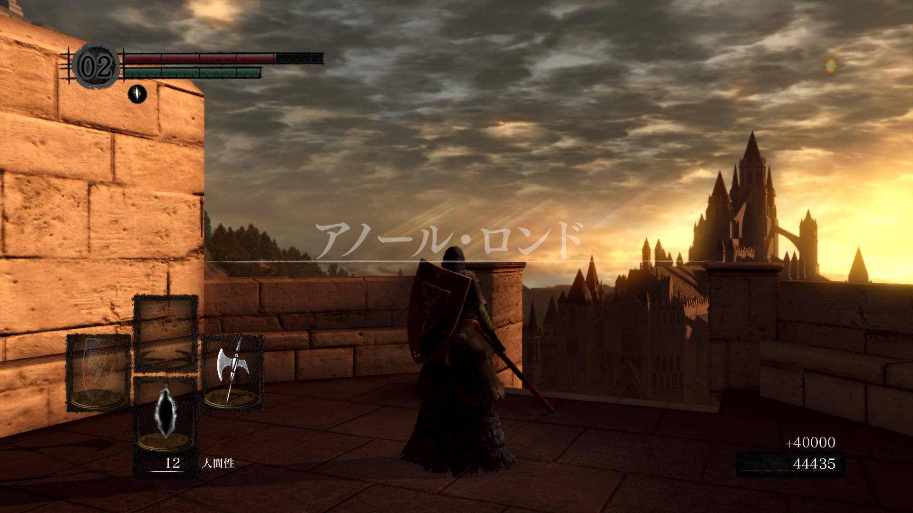

ダークソウルをクリアしました。

率直に言うと高難易度かつ暗い世界観は精神的にかなり辛かったが、同時にかなり面白いゲームであり、やはり屈指の名作と言わざるを得ない。

ダークソウルのボス戦の中でも面白かったのは、**混沌の魔女クラーグ**、**オンスモ**、**騎士アルトリウス**、**黒龍カラミット**、**深淵の主マヌス**、**薪の王グウィン**だったかな。
こうして見ると、DLCのボス戦は殆どが面白かった。ここでいう面白いとは理不尽な強さにより蹂躙されるというのではなく、相手のパターンを慎重に見つつ、防御・回避・スキを見ての攻撃を繰り返すこと、つまり**駆け引きを楽しめる**ということだ。DLCの方のボス戦は戦闘速度で言うと**SEKIRO**に近いのではとも感じた。ラスボスである**薪の王グウィン**には苦戦したものの、1回の動画学習でパリィのタイミングを確認したところ、その次の再戦で無傷で勝つことができてしまった。一方的にボコれるのは気持ちいいね。

上記でも触れたが、ダクソの特徴に**パリィ**というのがある。相手の攻撃に対してタイミングよくコマンドを押すことで、相手の攻撃を弾いて致命的な反撃を与えることができるというシステムだ。これは慣れないと難しいが、慣れると本当に気持ちがいい。[前回の記事](https://zsupohs.netlify.app/2020/08/dark-souls)でも書いたが、**ﾄﾞｩｵｰﾝ...**というパリィ成功の響きに応じて**ｽﾞｶﾞｼｭｫﾝ!!!**という響きの反撃をする、これがうっとりする。特にラスボスの薪の王をこれで嵌めて一方的に嬲り殺しにできたのは、ダクソで味わったこれまでのストレスをすべて返上できたようでとても嬉しかった。

また、ダクソは景色が美しい。**病み村**や**巨人墓場**のように陰鬱になるダンジョンが多かったが、その対比もあって上に載せた**アノール・ロンド**の遠景は本当に美しかった。加えてそれは既に栄華を失った廃城であり、それにも拘わらず未だに守り続ける異形たち（銀騎士、変なデーモン）……**BLAME!**を彷彿とさせるそれらに気分が高揚したものだ。もちろん、**病み村**などはそれでそれでグロテスクな魅力があり、元は人間だったのかな？みたいな異形はその経緯を考えさせられたり、**混沌の廃都イザリス**なんかもかつての栄光や一族の物語を偲ばせられたりしてしんみりする。**SEKIRO**も「滅びゆく葦名、竜の血の残滓」という**栄光の滅び**や**伝説の終り**をテーマにしたものだったが、（ダクソの方が早いんだけど）ダクソも常に滅びの雰囲気を漂わせており、感傷に浸らせる要素が散りばめられていた。

ダクソの世界観も魅力的だ。ダクソはおそらく、**竜の時代→火の時代→闇の時代**という変遷をめぐる物語なんだろうけれど、火と闇という単純な対比がありつつ、「闇の時代」＝「（不死）人の時代」っていうのも面白い。**深淵の主マヌス**なんかも「マヌス」＝「Manus」だから「Man」＝「人」と関係あるのかな……みたいな妄想にも浸れるし。ダクソのワードとして「**人間性**」っていうのがあるけど、ダクソは基本人間を邪悪なものとして捉えているな～という認識があり、世の中には人間賛美がテーマの作品はたくさんあるが、それらよりも私向きだったといえる。**人間性を捧げる**というのも意味深な……（意味深か？）。

久しぶりにクリアまでしたゲームだった。点数？点数は、う～ん……**星★★★★★**かな！

ダクソ2はあんま面白くないようなので、次があったらダクソ3やりたいと思います。